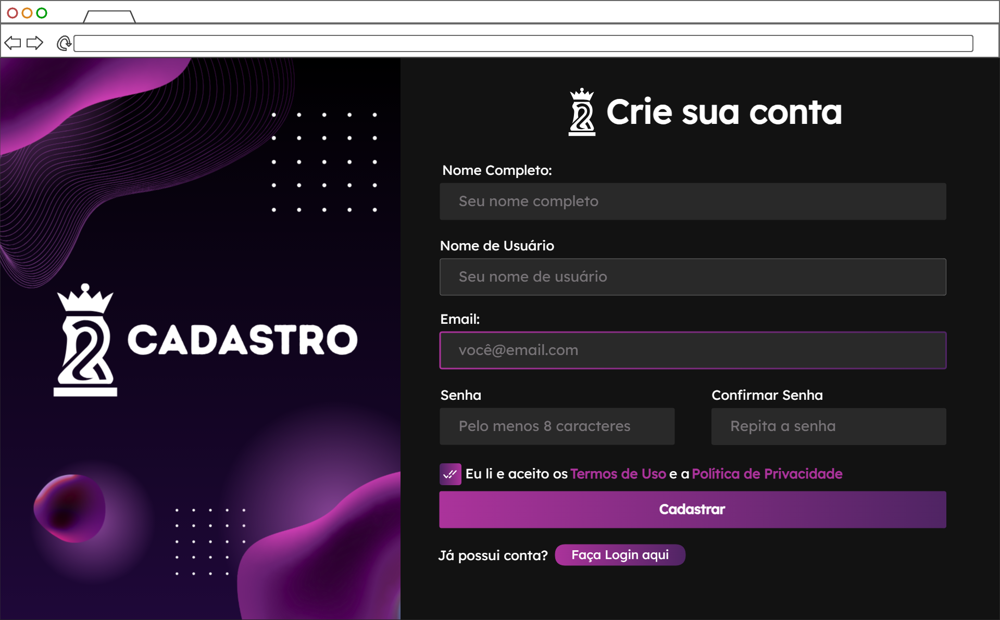
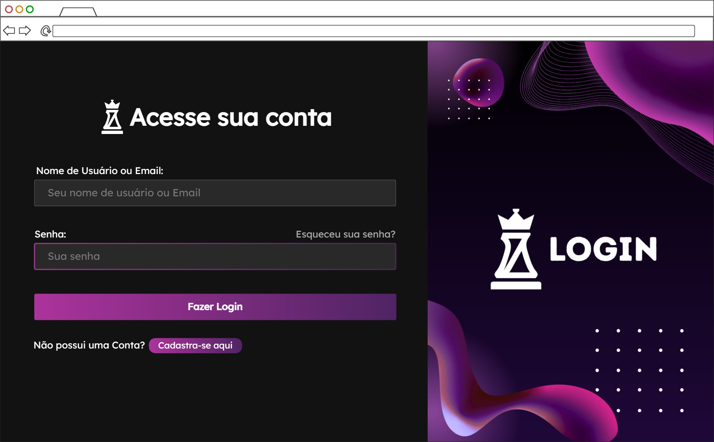
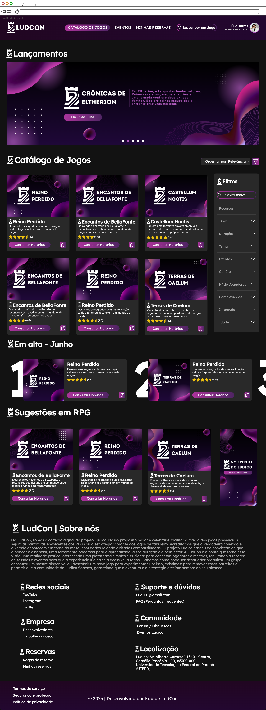
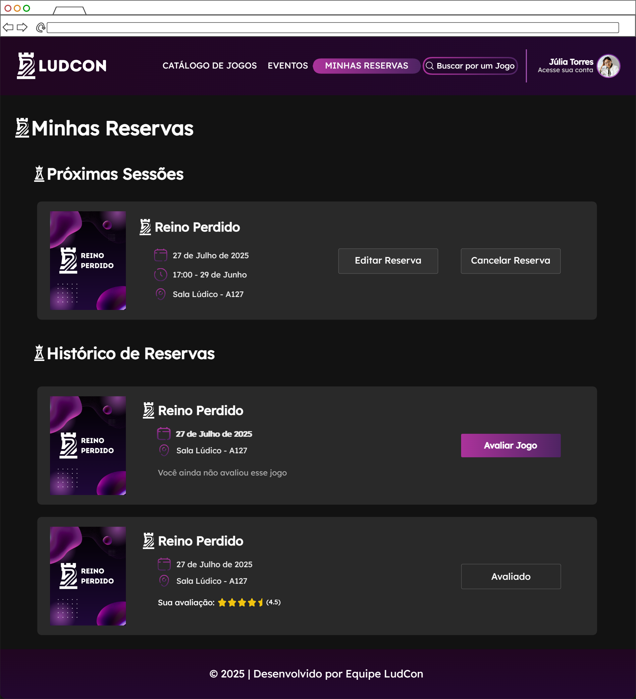
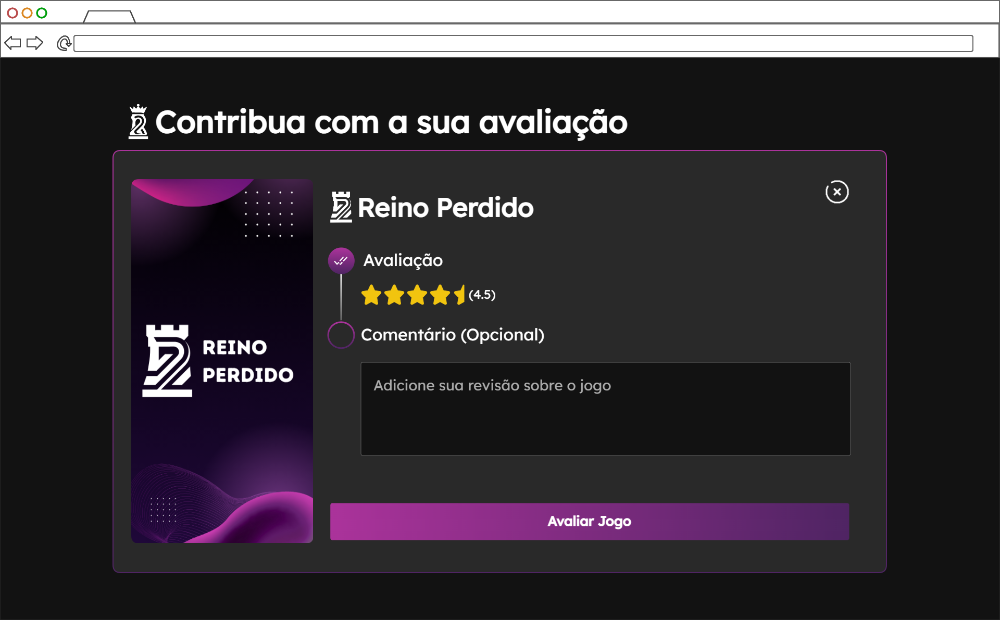
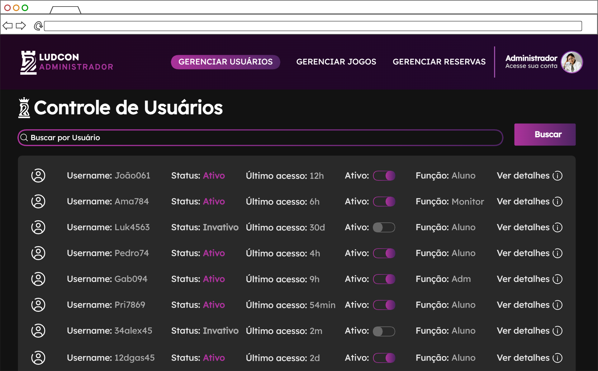
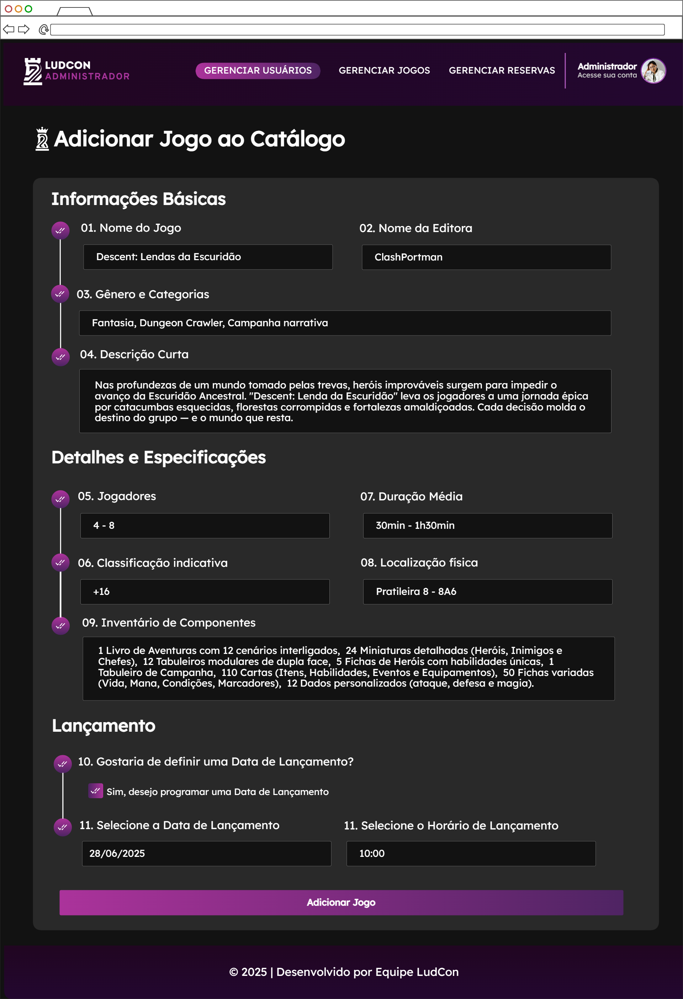
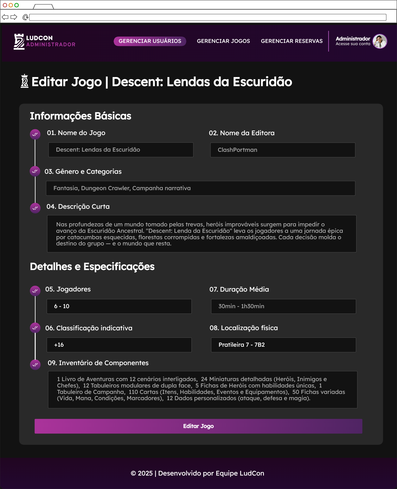

## Documentação - Prototipo

> 🔗[Acesse aqui](https://ninjamock.com/s/2Z1D7Lx) | Link do NinjaMock

### 🟣 Cadastro

Tela para que novos participantes criem um perfil na plataforma LudCon.

- Propósito: Registrar novos usuários no sistema.
- Componentes Principais:
  - Formulário de Cadastro:
    1. Nome Completo
    2. Nome de Usuário
    3. Email
    4. Senha
    5. Confirmar Senha
    6. Termos de Uso
  - Ações:
    1. Botão "Cadastrar" para criar a conta.
    2. Link "Faça Login" aqui para usuários que já possuem uma conta.

-----

### 🟣 Login

Tela para que usuários existentes acessem suas contas na plataforma.

  - Propósito: Permitir a autenticação de um usuário já registrado.
  - Componentes Principais:
      - Formulário de Acesso:
        1.  Campo para Nome de Usuário ou Email.
        2.  Campo para Senha.
        3.  Link de Esqueceu sua senha?.
  - Ações:
    1.  Botão "Fazer Login" para autenticar o usuário.
    2.  Link "Cadastra-se aqui" para redirecionar à tela de cadastro.

-----

### 🟣 Catálogo de Jogos

Tela principal que funciona como uma vitrine interativa do acervo de jogos.

  - Propósito: Apresentar os jogos disponíveis para consulta, descoberta e reserva.
  - Componentes Principais:
    1.  Cabeçalho de Navegação (Catálogo, Eventos, Minhas Reservas).
    2.  Barra de Busca por Jogo.
    3.  Seção "Lançamentos".
    4.  Seção "Catálogo de Jogos".
    5.  Seção "Em alta".
    6.  Seção "Sugestões".
    7.  Painel lateral de Filtros (Tipo, Duração, Tema, etc.).
    8.  Rodapé com informações do projeto.
  - Ações:
    1.  Clicar em "Consultar Horários" para ver detalhes de um jogo.
    2.  Utilizar a busca e os filtros para refinar a listagem.
    3.  Acessar o perfil do usuário.

-----

### 🟣Detalhes e Reserva de Jogo

Tela dedicada a um jogo específico, com suas informações e o fluxo para realizar uma reserva.

  - Propósito: Fornecer detalhes completos de um jogo e permitir seu agendamento.
  - Componentes Principais:
      - Seção de Reserva:
        1.  Seleção de Data.
        2.  Seleção de Horário (mostrando vagas disponíveis).
        3.  Confirmação do resumo da reserva.
      - Seção de Conteúdo:
        1.  Informações Gerais (Nome, Classificação, Jogadores, etc.).
        2.  Descrição Detalhada do jogo.
        3.  Avaliações de outros usuários.
  - Ações:
    1.  Botão "Reservar Jogo" para confirmar o agendamento.
    2.  Ler as avaliações para auxiliar na decisão.

-----

### 🟣 Minhas Reservas

Área pessoal onde o usuário pode gerenciar seus agendamentos.

  - Propósito: Centralizar e permitir o gerenciamento das reservas do usuário.
  - Componentes Principais:
    1.  Seção "Próximas Sessões" com as reservas futuras.
    2.  Seção "Histórico de Reservas" com as reservas passadas.
    3.  Exibição de data, horário e local para cada reserva.
  - Ações:
    1.  Botão "Editar Reserva" para alterar um agendamento futuro.
    2.  Botão "Cancelar Reserva" para desistir de um agendamento.
    3.  Botão "Avaliar Jogo" para dar feedback sobre uma sessão passada.

-----

### 🟣Avaliação de Jogo

Janela para o usuário dar feedback sobre um jogo que experimentou.

  - Propósito: Coletar a opinião e a nota dos usuários sobre os jogos do acervo.
  - Componentes Principais:
      - Formulário de Avaliação:
        1.  Seletor de 1 a 5 estrelas.
        2.  Campo de Comentário (Opcional).
      - Identificação do Jogo:
        1.  Imagem e nome do jogo sendo avaliado.
  - Ações:
    1.  Botão "Avaliar Jogo" para submeter o feedback.
    2.  Botão para fechar a janela de avaliação.

-----

### 🟣Painel do Administrador - Usuários

Tela da área administrativa para gestão de todos os perfis cadastrados na plataforma.

  - Propósito: Permitir que administradores visualizem, busquem e gerenciem os usuários do sistema.
  - Componentes Principais:
    1.  Cabeçalho Administrativo (Gerenciar Usuários, Jogos, Reservas).
    2.  Barra de Busca por Usuário.
    3.  Lista de Usuários.
      - Colunas da Lista:
        1.  Username.
        2.  Status (Ativo/Inativo).
        3.  Último acesso.
        4.  Interruptor (toggle) para ativar/desativar conta.
        5.  Função (nível de permissão).
  - Ações:
    1.  Buscar um usuário específico.
    2.  Ativar ou desativar uma conta de usuário.
    3.  Clicar em "Ver detalhes" para acessar o perfil completo.

-----

### 🟣Painel do Administrador - Adicionar Jogo

Formulário para que administradores possam incluir novos jogos no catálogo.

  - Propósito: Cadastrar um novo jogo com todas as suas especificações no sistema.
  - Componentes Principais:
      - Formulário de Cadastro de Jogo:
        1.  Informações Básicas (Nome, Editora, Gênero, Descrição).
        2.  Detalhes e Especificações (Jogadores, Duração, Classificação, Localização).
        3.  Inventário de Componentes.
        4.  Seção para agendamento de Lançamento.
  - Ações:
    1.  Botão "Adicionar Jogo" para salvar o novo item no banco de dados.

-----

### 🟣 Painel do Administrador - Editar Jogo

Interface para modificar as informações de um jogo que já existe no catálogo.

  - Propósito: Permitir a atualização e correção dos dados de um jogo já cadastrado.
  - Componentes Principais:
      - Formulário de Edição de Jogo:
        1.  Todos os campos do formulário de "Adicionar Jogo", já preenchidos com os dados atuais do item.
  - Ações:
    1.  Botão "Editar Jogo" para salvar as alterações realizadas.
